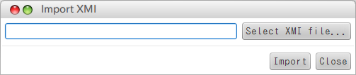

XMI import plugin
===============================

version
----------------
1.0.0

Available for
------------------
Astah Professional 6.6.4 or later.
Astah http://astah.net

Description
----------------
This plugin provides to load XMI file and import model information at class diagram.

Notes
----------------
 * This plugin supports to load XMI version 2.1
 * The diagrams and presentations aren't supported by this plugin. This plugin only supports to import model information.
 * There are some notation issues if you integrate to other tools.

Limitations
----------------
 * Doesn't support to set attribute visibility. (6.6.4)
 * Doesn't support to set TemplateBinding and TemplateParameter.

How to install
----------------
 1. Deploy the jar file you downloaded, to the "plugins" folder in the Astah's install folder.
 2. Launch Astah.
 3. You find the "XMI" under the "Tool".Click "XMI import" under the menu.

How to use
----------------
 1. Launch Astah, and click "XMI Import" .
 2. Select xmi file in the file selection dialog.
 3. Click the "import" button, it starts to import the XMI.
 4. It will be shown "finish to import the xmi file".

How to uninstall
------------------------
Delete the plugin jar file at the [Astah's install folder]/plugins.

Build & Testing
-----------------
1. Install Astah Plug-in SDK
2. clone the source code.

    git clone [Repository URL]

3. Build

    astah-build

4. Unit Testing

    astah-mvn test

Extend this Plugin
-------------------

This plugin has extension point to import another model type.

How to extend
-----------------
1. Install Astah Plug-in SDK
2. Install this plugin to local repository.

    astah-mvn install:install-file -Dfile=xmi-1.0.0.jar -DgroupId=com.change_vision.xmi -DartifactId=xmi -Dversion=1.0.0 -Dpackaging=jar -DgeneratePom=true

3. Generate extension plugin.

    astah-generate-plugin

4. Add this plugin to extension plug-in's pom.xml.

    <dependency>
        <groupId>com.change_vision.astah</groupId>
        <artifactId>xmi</artifactId>
        <version>1.0.0</version>
        <scope>provided</scope>
    </dependency>
    
5. Implement converter.

Case1. Classifier model like UseCase, implement ClassifierConverter. ex. com.change_vision.astah.xmi.internal.convert.model's classes

Case2. Relation model like association、implement RelationConverter. ex. com.change_vision.astah.xmi.internal.convert.relationship's classes.

6. Register your converters to BundleContext. BundleContext is passed by Activator's start/stop. Register like below.

	import org.osgi.framework.BundleActivator;
	import org.osgi.framework.BundleContext;
	
	import com.change_vision.astah.xmi.convert.model.ClassifierConverter;
	import com.change_vision.astah.xmi.convert.relationship.RelationshipConverter;
	
	public class Activator implements BundleActivator {
	
		public void start(BundleContext context) {
			// for Classifier
		    context.registerService(ClassifierConverter.class.getName(), new HogeConverter(), null);
		    // for Relationship
		    context.registerService(RelationshipConverter.class.getName(), new FugaConverter(), null);
		}
	
		public void stop(BundleContext context) {
		}
		
	}

License
---------------
Copyright 2012 Change Vision, Inc.

Licensed under the Apache License, Version 2.0 (the "License");
you may not use this work except in compliance with the License.
You may obtain a copy of the License in the LICENSE file, or at:

   <http://www.apache.org/licenses/LICENSE-2.0>

Unless required by applicable law or agreed to in writing, software
distributed under the License is distributed on an "AS IS" BASIS,
WITHOUT WARRANTIES OR CONDITIONS OF ANY KIND, either express or implied.
See the License for the specific language governing permissions and
limitations under the License.
