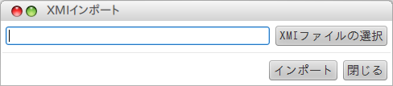

XMIインポートプラグイン
===============================

バージョン
----------------
1.0.0

利用可能なastah
------------------
astah professional 6.6.4以上

概要
----------------
本プラグインはXMI形式のファイルからクラス図のモデル情報をインポートするプラグインです。

注意事項
----------------
 * 対応するXMIバージョンは2.1です。
 * クラス図のモデル情報のみインポートします。図や図要素などは移行できません。
 * 他ツールとの連携を行う場合は、一部の表記が異なる場合があります。
 * 関連端の可視性の設定はサポートしません。 (6.6.4)

インストール方法
----------------
1. astahのインストールフォルダ配下のpluginsフォルダに本プラグインのjarファイルを置きます。
2. astahを起動します。
3. メニューバーの「ツール」の中に「XMI」と表示されます。その下にある「XMIインポート」を実行してください。

アンインストール方法
------------------------
astahのインストールフォルダ配下のpluginsフォルダから本プラグインのjarファイルを削除してください。

使用例
----------------
1. astahを起動し、メニューバーの「ツール」の一番下に「XMIインポート」をクリックします。
2. ファイル選択ダイアログでxmiファイルを選択します。
3. 「インポート」というボタンをクリックするとインポートが始まります。
4. 終了すると「XMIファイルのインポートを終了しました。」というメッセージが表示されます。

ライセンス
---------------
Copyright 2012 Change Vision, Inc.

Licensed under the Apache License, Version 2.0 (the "License");
you may not use this work except in compliance with the License.
You may obtain a copy of the License in the LICENSE file, or at:

   <http://www.apache.org/licenses/LICENSE-2.0>

Unless required by applicable law or agreed to in writing, software
distributed under the License is distributed on an "AS IS" BASIS,
WITHOUT WARRANTIES OR CONDITIONS OF ANY KIND, either express or implied.
See the License for the specific language governing permissions and
limitations under the License.
